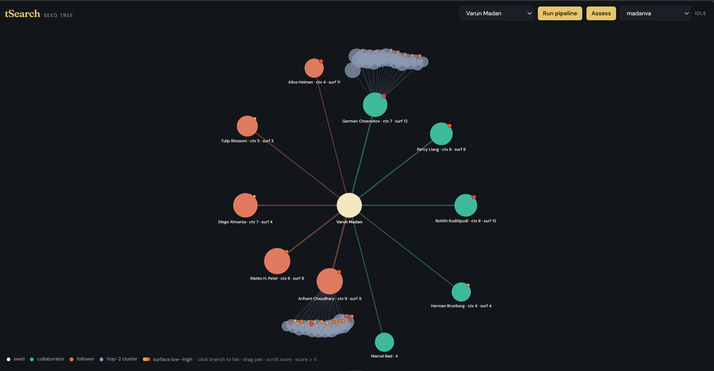
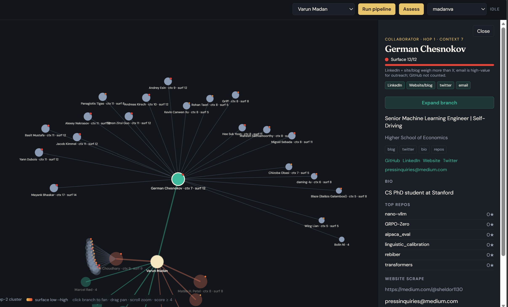
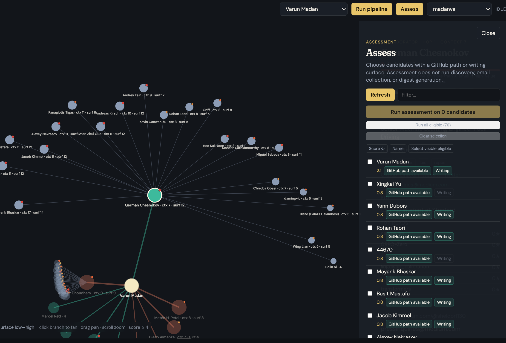

# tSearch

Unseen talent discovery: resolve olympiad / named seeds on LinkedIn, enrich from personal sites, expand a GitHub (and Substack) graph, inspect people on a radial tree, run LLM judges on public work, and email a shortlist with profile links and named repos/articles.

```text
login (cookies) → resolve LinkedIn + websites → expand GitHub/Substack (hop-1)
       → optional hop-2 branch expand → score → candidates.json + profiles/
       → assessment judges → digest email
```

**Hard boundary:** assessment reads `output/candidates.json` only. It does **not** re-run LinkedIn discovery or fix a wrong identity.

---

## Screenshots

PNG paths (already linked below):

| File | Capture |
|------|---------|
| [`docs/images/radial-tree.png`](docs/images/radial-tree.png) | Top bar + radial seed tree |
| [`docs/images/profile-panel.png`](docs/images/profile-panel.png) | Node selected, profile drawer open |
| [`docs/images/assess-panel.png`](docs/images/assess-panel.png) | **Assess** panel open |



*Seed-rooted radial graph (collaborators / followers / hop-2 clusters).*



*Hop-1 profile: surface metrics, links, repos, expand branch.*



*Assessment eligibility (GitHub path / writing) over discovery candidates.*

---

## Quick start

```bash
npm install
cp .env.example .env          # fill GITHUB_TOKEN, OPENAI_API_KEY, DIGEST_*, etc.
npm run login                 # Playwright → cookies.json (required for live LinkedIn)
npm run pipeline              # batch discovery from SEEDS_PATH
# or:
npm run dev                   # API :8787 + Vite :5173 — Run pipeline / Assess from UI
```

Do not commit `.env` or `cookies.json`.

---

## Architecture overview

| Layer | Responsibility | Primary code |
|-------|----------------|--------------|
| Session | LinkedIn Playwright storageState | `src/linkedin/saveSession.ts`, `linkedinBrowser.ts` |
| Resolve | Name → LinkedIn profile → website GitHub override | `src/pipeline/resolveIdentities.ts` |
| Expand | Hop-1 collaborators/followers/Substack | `src/pipeline/expandGraph.ts`, `src/github/` |
| Hop-2 | Opt-in expand under one hop-1 node | `src/pipeline/runBranchExpand.ts` |
| Score | Discovery `final_score` heuristic | `src/scoring/computeScore.ts` |
| Persist | `candidates.json`, `profiles/`, `data/people/`, `cache/` | `mergeCandidates.ts`, `profileStore.ts`, `personStore.ts` |
| UI API | Seeds, trees, profiles, spawn pipeline | `server/index.ts`, `server/runs.ts`, `server/tree.ts` |
| Assess | LLM judges on frozen candidate IDs | `src/assessment/` |
| Digest | Top-N brief + Resend | `src/digest/` |

---

## LinkedIn pipeline (technical)

### 1. Session (`npm run login`)

Entry: [`src/linkedin/saveSession.ts`](src/linkedin/saveSession.ts).

1. Launches Chromium headed (`BROWSER_LAUNCH_OPTIONS`, `slowMo: 50` from [`src/config.ts`](src/config.ts)).
2. Opens `https://www.linkedin.com/login`.
3. You log in manually; press Enter in the terminal when the feed is visible.
4. Writes Playwright **`storageState`** (cookies + origins) to `COOKIES_PATH` (default **`cookies.json`**).

Runtime open: [`openLinkedInSession()`](src/linkedin/linkedinBrowser.ts) loads that storageState, navigates to `/feed/`, and **throws** if redirected to `/login` or `/checkpoint` (expired session).

| Behavior | Detail |
|----------|--------|
| CLI `npm run pipeline` | Warns if cookies missing; can limp on cache-only |
| UI `POST /api/runs` | **Requires** cookies (`400` if absent) |
| Laziness | Browser opens on first live LinkedIn miss inside resolve/branch; closed in `finally` |

**Pacing:** `LINKEDIN_DELAY_MS` (default **1200**) after profile loads and searches, plus smaller fixed sleeps on contact/detail fetches. There is no RPM governor — delays only. Automation detection, captchas, and account restriction are expected failure modes.

### 2. Seeds

| Source | How |
|--------|-----|
| Batch file | `SEEDS_PATH` → default [`src/seeds/seeds.json`](src/seeds/seeds.json) — `{ name, country }[]` via [`parseSeeds`](src/seeds/parseSeeds.ts) |
| Cap | `MAX_IDENTITY_RESOLVES` (default **40**); remainder marked not attempted |
| Olympiad CSV | `OLYMPIAD_CSV` (default `olympiad_winners.csv`) loaded every pipeline run for scoring + search hints |
| `npm run seeds` | [`olympiad_seeds.py`](olympiad_seeds.py) writes **`output/olympiad_seeds.json`** — does **not** overwrite `seeds.json`; promote names manually |
| UI Run | `POST /api/runs` writes a one-seed temp file, sets `SEEDS_PATH` + `MAX_IDENTITY_RESOLVES=1` |

### 3. Identity resolve ([`resolveIdentities`](src/pipeline/resolveIdentities.ts))

Per seed (LinkedIn work is sequential; website enrichment can overlap):

1. **Skip if already scraped** — [`candidateLookup`](src/pipeline/candidateLookup.ts) finds a matching person in existing `candidates.json` with LinkedIn `scrape_version === 9`.
2. **People search** — [`searchLinkedInByName`](src/linkedin/linkedinSearch.ts); results cached under `cache/linkedin-search/`.
3. **Match** — [`pickBestLinkedInHit` / `isSearchConfirmed`](src/linkedin/linkedinMatch.ts) using name, country, olympiad hints ([`countryMatch`](src/linkedin/countryMatch.ts)).
4. **Scrape or cache** — [`extractLinkedInProfile`](src/linkedin/linkedinExtract.ts) → `cache/linkedin-profile-v2/` (TTL **30d**; bypass with `FORCE_REFRESH=1`).
5. **Website enrichment** — `enrichIdentityFromWebsite` scrapes `personal_website` / `website_url` ([`scrapeWebsite`](src/website/) or equivalent). **Website-discovered GitHub overrides** LinkedIn-derived GitHub URLs (Contact/Featured only for socials — avoids grabbing strangers’ links from the page blob).

#### LinkedIn profile fields (`scrape_version` **9**)

From main profile + Contact info + education / experience / honors detail pages:

- Identity: `url`, `name`, `photo_url`, `headline`, `country`
- Education / experience / awards / skills / keywords
- Links from Contact + Featured: `github_url`, `substack_url`, `twitter_url`, `personal_website` / `website_url`, `contact_links[]`

`isFullLinkedInProfile` treats version 9 + present education/experience/awards arrays as complete (**empty arrays still count as full** — weak scrapes can stick in cache).

### 4. Graph expand hop-1 ([`expandGraph`](src/pipeline/expandGraph.ts))

For each resolved identity:

1. Seed into the candidate pool (`discovered_via: linkedin:…`).
2. Resolve GitHub URL: **website first**, then LinkedIn / identity.
3. [`expandGithubFromUrl`](src/github/githubExpand.ts):
   - Profile + followers/following
   - Top `MAX_REPOS_EXPAND` (default **5**) repos → contributors (**collaborators**), stargazers/forkers (peripheral)
4. Hydrate up to `MAX_COLLABORATOR_PROFILES` (default **15**) collaborators → seed-tree edges `via: github-collaborator`, hop **1**; optional blog from GitHub `blog`.
5. Hydrate up to `MAX_FOLLOWER_PROFILES` (default **20**) followers; keep those with `context_score >= MIN_CONTEXT_SCORE_TO_EXPAND` (default **2**) → `github-follower` edges.
6. If Substack URL: expand + up to ~10 neighbor slugs (`SUBSTACK_DELAY_MS`, default **600**).

`context_score` is computed when fetching GitHub profiles (identity-surface / GitHub helpers under `src/github/`). The UI tree later filters hop≥1 nodes with `MIN_TREE_CONTEXT_SCORE` (default **4**).

### 5. Hop-2 (opt-in only)

Default pipeline **stops at hop-1**. Hop-2 requires UI **Expand branch** (or env):

- `POST /api/runs/branch` → spawn with `BRANCH_EXPAND=1` + `BRANCH_ROOT`, `BRANCH_PARENT`, `BRANCH_RELATION`, `BRANCH_LINKEDIN`, `BRANCH_GITHUB`, `BRANCH_NAME`
- [`runBranchExpand`](src/pipeline/runBranchExpand.ts) scrapes/enriches that hop-1 parent and writes nested profiles:

```text
profiles/<seed>/<collaborators|followers>/<parent>/{collaborators|followers}/<login>/profile.json
```

UI only offers expand when the hop-1 node has a LinkedIn URL (`can_expand` in `server/tree.ts`).

### 6. Merge, score, persist

[`mergeCandidates`](src/pipeline/mergeCandidates.ts) dedups the pool, runs [`scoreCandidate`](src/scoring/computeScore.ts), sorts by `final_score`, truncates to `MAX_CANDIDATES` (default **80**), writes:

| Artifact | Purpose |
|----------|---------|
| `output/candidates.json` | Ranked discovery candidates (assessment input) |
| `output/seed_tree.json` | Edges: from/to, via, hop, context |
| `profiles/<seed>/…` | On-disk tree for the radial UI |
| `data/people/<slug>.json` | Accumulating person metadata (seeds + olympiad pedigree) |
| `cache/**` | LinkedIn / website / GitHub / Substack JSON caches |

#### Discovery score (`final_score`)

From [`computeScore`](src/scoring/computeScore.ts):

| Component | Heuristic |
|-----------|-----------|
| `builder` | GitHub active +0.3; repos > 3 → +0.2; recent_commits > 5 → +0.2 |
| `thinker` | Substack active +0.3; posts > 5 → +0.2 |
| `olympiad` | `olympiadScore*0.3 + medalScore*0.2 + recencyScore*0.1` from CSV |
| `weirdness` | +0.3 if any repo topic matches `WEIRD_TOPICS` |
| `identity` | `identity_confidence * 0.2` |
| **`final_score`** | Sum of the five |

Assessment copies this into `source_snapshot.discovery_score` for display only. Ranking for uses assessment **priority_score**.

### Candidate JSON shape (abridged)

```json
{
  "name": "…",
  "key": "…",
  "discovered_via": ["linkedin:…", "github-collaborator:…"],
  "linkedin": { "url": "…", "scrape_version": 9, "github_url": "…", "…": "…" },
  "identity_confidence": 0.85,
  "github": { "username": "…", "context_score": 7, "repos": [], "…": "…" },
  "website": { "url": "…" },
  "olympiad": { "…": "…" },
  "final_score": 2.09,
  "score_breakdown": {
    "builder": 0.5, "thinker": 0, "olympiad": 0.9, "weirdness": 0.3, "identity": 0.17
  }
}
```

### LinkedIn / discovery caveats

1. **ToS / ban risk** — Headed automation against search, profile, contact, and detail pages. Use a disposable account; prefer cache; raise `LINKEDIN_DELAY_MS` if challenged.
2. **Session fragility** — Expired cookies abort live resolve; UI hard-fails without `cookies.json`.
3. **Wrong LinkedIn → wrong tree** — Matching is heuristic; website GitHub override helps only when Contact lists a real personal site.
4. **Hop-2 is not automatic** — One `npm run pipeline` does not build deep fans; use Expand branch.
5. **`olympiad_seeds.py` ≠ `seeds.json`** — Separate promotion step.
6. **Empty arrays = “full” scrape** — Cache may skip re-scrape after a thin extract.
7. **OneDrive / Windows** — Atomic JSON writes retry on `EPERM`; still an ops hazard under synced folders.

---

## Web UI and API

```bash
npm run dev          # concurrently API + Vite
npm run dev:api      # Express only → http://localhost:8787
npm run dev:web      # Vite only → http://localhost:5173 (proxies /api)
```

| Method | Route | Role |
|--------|-------|------|
| GET | `/api/seeds` | Seed options + which trees exist on disk |
| GET | `/api/tree/:seedSlug` | Radial tree (filters hop≥1 by `MIN_TREE_CONTEXT_SCORE`) |
| GET | `/api/profile/...` | Seed / hop-1 / hop-2 profile JSON |
| POST | `/api/runs` | Spawn discovery pipeline for one seed |
| POST | `/api/runs/branch` | Hop-2 expand |
| GET | `/api/runs/:id/events` | SSE logs |
| GET | `/api/candidates` | Thin candidates for Assess eligibility |
| * | `/api/assessment/runs…` | Assessment prepare / poll / retry |

Frontend: [`web/src/App.tsx`](web/src/App.tsx), [`RadialTree.tsx`](web/src/RadialTree.tsx), [`ProfilePanel.tsx`](web/src/ProfilePanel.tsx), [`AssessPanel.tsx`](web/src/AssessPanel.tsx).

---

## Assessment pipeline

Requires populated `output/candidates.json`. Does **not** call LinkedIn.

```bash
npm run assess:candidates -- --input output/candidates.json
# --limit 10  --resume arun_…  --retry-errors  --force-candidate cand_…
```

Or use **Assess** in the UI (`POST /api/assessment/runs`).

Per candidate (see [`assessCandidate.ts`](src/assessment/assessCandidate.ts)):

1. Collect GitHub repos (selection + artifact fetch) and/or blog articles  
2. Technical + writing judges (parallel when both apply); then cross-artifact / when linked  
3. Synthesis → `priority_score`; persist under `output/assessment-runs/<arun_…>/`  
4. UI shows named linked citations from `artifacts.references` / evidence  

**Eligibility:** GitHub username and/or writing surface already on the candidate record.

**Speed:** `ASSESSMENT_CANDIDATE_CONCURRENCY`, `ASSESSMENT_REPO_FETCH_CONCURRENCY`, `GITHUB_DELAY_MS`, `ASSESSMENT_REPOSITORY_LIMIT`. Live judges need `LLM_PROVIDER` (`openai` default, or `anthropic`) plus the matching API key (`OPENAI_API_KEY` / `ANTHROPIC_API_KEY`); `ASSESSMENT_MOCK_LLM=1` for deterministic offline.

Judges coerce scored dimensions missing evidence IDs (demote / backfill) rather than always failing closed.

---

## Email digest

Built from a finished assessment run (**no** extra LLM). Selects priority ≥ `DIGEST_MIN_PRIORITY` (default **50**), top 5–10 (`DIGEST_TOP_N`). Each card: GitHub / LinkedIn / website links + brief naming specific repos/articles ([`buildCoryBrief`](src/digest/buildCoryBrief.ts)).

```bash
npm run digest:generate -- --run arun_<id>
npm run digest:send -- --digest digest_<id> --dry-run
npm run digest:send -- --digest digest_<id>
```

`DIGEST_EMAIL_FROM` must be on a Resend-verified domain. Email is **never** auto-sent after assess — only `digest:send`. UI runs often set `skip_digest`; regenerate when ready.

---

## Environment reference

Discovery ([`src/config.ts`](src/config.ts)):

| Variable | Default | Purpose |
|----------|---------|---------|
| `COOKIES_PATH` | `cookies.json` | LinkedIn storageState |
| `SEEDS_PATH` | `src/seeds/seeds.json` | Seed list |
| `OLYMPIAD_CSV` | `olympiad_winners.csv` | Medalists |
| `OUTPUT_PATH` | `output/candidates.json` | Discovery output |
| `CACHE_DIR` / `PROFILES_DIR` / `PEOPLE_DIR` | `cache` / `profiles` / `data/people` | Artifacts |
| `LINKEDIN_DELAY_MS` | `1200` | Scrape pacing |
| `GITHUB_DELAY_MS` | `800` | GitHub API pacing |
| `GITHUB_TOKEN` | or `gh auth token` | API auth |
| `MAX_IDENTITY_RESOLVES` | `40` | Seed resolve cap |
| `MAX_CANDIDATES` | `80` | Output trim |
| `MAX_COLLABORATOR_PROFILES` | `15` | Collab hydrate |
| `MAX_FOLLOWER_PROFILES` | `20` | Follower hydrate |
| `MIN_CONTEXT_SCORE_TO_EXPAND` | `2` | Rich-follower gate |
| `MIN_TREE_CONTEXT_SCORE` | `4` | UI tree filter |
| `MAX_REPOS_EXPAND` | `5` | Repos per expand |
| `FORCE_REFRESH` | off | Ignore cache TTLs |
| `API_PORT` | `8787` | Express |

Assessment / digest — see [`.env.example`](.env.example) (`ASSESSMENT_*`, `DIGEST_*`, `RESEND_API_KEY`). Ignore placeholder `EMAIL_PROVIDER_API_KEY=re_...`.

---

## Tests

```bash
npm test
npm run test:assessment
npm run test:web
npm run typecheck
```

---

## Repo map

| Path | Role |
|------|------|
| `src/linkedin/` | Session, search, match, extract |
| `src/pipeline/` | Resolve, expand, merge, branch hop-2 |
| `src/github/` | Profile fetch, expand, context scores |
| `src/scoring/` | Discovery `final_score` |
| `src/assessment/` | Collectors, judges, synthesis, run store |
| `src/digest/` | Digest document + email |
| `server/` | HTTP API, tree, assessment spawn |
| `web/` | Radial UI |
| `scripts/` | CLI wrappers |
| `rubrics/` | Judge YAML |
| `docs/` | Specs / audits |
| `output/` | Candidates, runs, digests (local) |
| `profiles/` | UI tree on disk |
| `cache/` | Scrape / API caches |

---

## Further docs

- [Assessment digest](docs/assessment-digest.md)
- [LLM judge protocol](docs/llm_judge_protocol.md)
- [Cory calibration](docs/cory_calibration_protocol.md)
- [Ownership decision tree](docs/ownership_decision_tree.md)
- [GitHub signal spec](docs/github_signal_spec.md)
- [Blog collector spec](docs/blog_collector_spec.md)
- Audits under [`docs/`](docs/) (`assessment-rubric-*`, `rubric-agents-*`, wiring reports)
