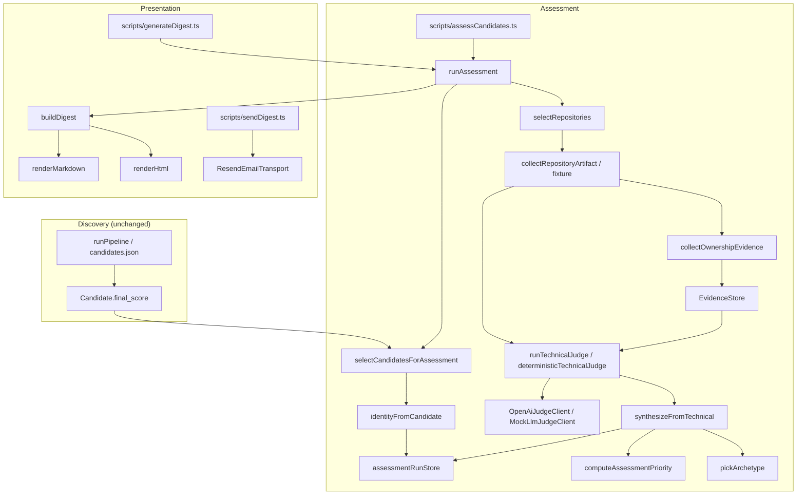
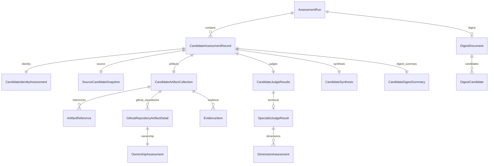

# tSearch Assessment Rubric Architecture Audit

**Audit date:** 2026-07-21  
**Scope:** Live repository after Assessment + Email Digest Phase 1–2 implementation  
**Constraint:** Read-only inspection of production code; offline tests and typecheck only; no live assessment or email send  

---

## 1. Executive summary

### What Phase 1 actually implemented

An additive assessment layer beside discovery:

* CLI `npm run assess:candidates` → `runAssessment()` loads `candidates.json`, selects top candidates by discovery `final_score`, assigns stable `cand_*` IDs, creates an immutable-when-completed run under `output/assessment-runs/<id>/`, collects GitHub repository artifacts, builds evidence items, runs a technical specialist judge (OpenAI or deterministic mock), synthesizes priority + archetype, and optionally renders a digest.
* Discovery `Candidate.final_score` is **not** overwritten; it is snapshotted as `source_candidate.discovery_score`.
* Durable JSON run metadata, per-candidate assessments, source-candidate snapshot, digest JSON/MD/HTML.
* Evidence ID validation, motivation-language guards, high-score strong-evidence rules.
* Artifact and judge disk caches under `cache/assessment/`.

### What Phase 2 actually implemented

* Priority scoring (`priority-v1`) with missing-domain weight redistribution.
* A **curiosity proxy** = mean of `unusual_problem_selection` and `persistence_and_iteration` technical dimensions — labeled as proxy in digest copy.
* Deterministic archetype assignment from technical + ownership signals only.
* Digest ranking by `assessment_priority_score`, showing discovery vs assessment separately.
* Explicit email send path (`digest:send` / Resend) outside automatic assessment.

### Major deviations from the original plan

| Deviation | Reality |
| --------- | ------- |
| Research / writing / publication / article tracks | Config limits and type slots exist; **no collectors or judges run** |
| Multi-judge synthesis | Only `synthesizeFromTechnical`; research/writing/curiosity judges are type stubs |
| Repository selection enrichment | `selectRepositories` accepts `details` (fork/archived/size) but live path never passes them |
| Ownership quantification | Commit “share” is computed against **candidate-only** commit samples, so share ≈ 1.0 whenever any commits exist |
| LLM ownership object | Required in technical LLM schema, then **discarded** except for confidence floor |
| Run `artifacts/` directory | Created empty; artifacts live inside assessment JSON |
| Digests | Regenerable from assessments without LLM/GitHub for **content**, but `digest_id` is time-bucketed (not fully deterministic) |

### Whether the architecture is safe to extend

**Conditionally yes.** Discovery → Assessment → Presentation separation holds. Types already reserve blog/paper/judge slots. Extension is unsafe **until** ownership sampling and live repo-selection details are fixed, and until judge-cache schema revalidation is added when rubric schemas change.

### Three highest-risk technical issues

1. **Ownership inflation:** `total_commits_sampled` equals candidate commit count (or 1), so owner-matched repos with any commits become `primary_creator` / score 8 almost automatically (`collectRepositoryFromFixture` → `collectOwnershipEvidence`).
2. **Live selection ignores fork/archived/size:** `runAssessment` calls `selectRepositories({ username, repos })` without API details; negative features for forks/templates that need `details` never fire on the live path.
3. **Judge cache returns unvalidated payloads:** `readJudgeCache` returns stored JSON without re-running Zod/schema validation — schema or prompt-version changes can serve stale incompatible objects until TTL/force refresh.

### Three highest-value extension points

1. Generalize `ArtifactReference` + `EvidenceStore` + `LlmJudgeClient` for blog/article artifacts (types already include article/paper source kinds).
2. Attach versioned rubric files beside `src/assessment/judges/prompts/` and fold rubric version into judge `cacheNamespace` / `input_hash`.
3. Introduce `ArtifactRelationship` + a synthesis judge that consumes technical + writing results without rewriting run-store layout.

---

## 2. Current architecture diagram



---

## 3. Live execution flows

### 3.1 Assessment CLI — `npm run assess:candidates`

**Entry:** `scripts/assessCandidates.ts` → `runAssessment()` in `src/assessment/runAssessment.ts`

| Step | Function | Input | Output | Errors | Cache | Persist |
| ---- | -------- | ----- | ------ | ------ | ----- | ------- |
| Load | `loadCandidatesFromPath` | file path | `Candidate[]` | throw if missing/non-array | none | none |
| Select | `selectCandidatesForAssessment` | candidates, limit/id/seed | `SelectedCandidate[]` | empty possible | none | none |
| Create run | `createAssessmentRun` | source hash, config | `AssessmentRun` | refuse overwrite of completed same id | none | `run.json` atomic |
| Snapshot | `writeSourceCandidates` | selected snapshots | void | — | none | `source-candidates.json` |
| Per candidate | `assessOne` | selected | `CandidateAssessmentRecord` | caught → `error` on record + `appendRunError` | artifact/judge caches | `assessments/<cand_id>.json` |
| Repos | `selectRepositories` | repos from discovery profile | `SelectedRepo[]` | skip score&lt;0 | none | none |
| Collect | `collectRepositoryArtifact` or fixture | owner/repo | reference+detail+evidence | rate-limit throws; isolated per candidate | artifact TTL 14d | embedded in record; cache file |
| Judge | `runTechnicalJudge` / `deterministicTechnicalJudge` | repos+evidence | `SpecialistJudgeResult` | schema/evidence validation throws → candidate error | judge TTL 30d | in record |
| Synthesize | `synthesizeFromTechnical` | technical+ownership | `CandidateSynthesis` | — | none | in record |
| Digest | `renderDigestForRun` | runId | digest_id | throw if run missing | none | run + `output/digests/` |
| Complete | `updateAssessmentRunStatus(..., "completed")` | — | run | completed runs immutable | none | `run.json` |

**Flags:** `--input`, `--limit`, `--repository-limit`, `--candidate`, `--seed`, `--force` (sets `ASSESSMENT_FORCE_REFRESH`), `--mock`, `--skip-digest`.

**No server/API assessment routes** exist under `server/`.

### 3.2 Digest regenerate — `npm run digest:generate -- --run <id>`

`scripts/generateDigest.ts` → `renderDigestForRun(runId)` → `listCandidateAssessments` → `buildDigest` → `renderMarkdown` / `renderHtml` → write run + digests dirs.

Does **not** call OpenAI or GitHub. May re-read `run.source.candidates_path` only for discovered-count metadata.

### 3.3 Digest send — `npm run digest:send` (not run in this audit)

Loads persisted digest files; `ResendEmailTransport` or `TestEmailTransport` / dry-run. Outside assessment judging.

### 3.4 Offline test path

`runAssessment({ mockLlm: true, fixtureReposByUser })` skips network GitHub and uses `collectRepositoryFromFixture` + deterministic judge when no `llmClient` injected.

---

## 4. File and module inventory

| File | Main exports | Responsibility | Called by | Calls | Runtime status |
| ---- | ------------ | -------------- | --------- | ----- | -------------- |
| `scripts/assessCandidates.ts` | CLI `main` | Assessment CLI | npm script | `runAssessment` | active |
| `scripts/generateDigest.ts` | CLI `main` | Digest regenerate CLI | npm script | `renderDigestForRun` | active |
| `scripts/sendDigest.ts` | CLI `main` | Email send CLI | npm script | `sendDigest` | active |
| `src/assessment/runAssessment.ts` | `runAssessment`, `renderDigestForRun`, `RunAssessmentOptions` | Orchestration | scripts, tests | select/store/collect/judge/digest | active |
| `src/assessment/config.ts` | limits, dirs, `PROMPT_VERSIONS`, `PRIORITY_WEIGHTS`, email env | Config | assessment + digest | dotenv | active |
| `src/assessment/types.ts` | assessment domain types, `TECHNICAL_DIMENSIONS` | Data model | everywhere | — | active |
| `src/assessment/schemas.ts` | Zod schemas, `parseWithSchema` | LLM/runtime validation | llmClient, technicalJudge | zod | active |
| `src/assessment/candidateIdentity.ts` | `resolveCandidateIdentity`, `identityFromCandidate`, `githubUsernameFromCandidate` | Stable IDs | selectCandidates, tests | crypto | active |
| `src/assessment/selectCandidates.ts` | `loadCandidatesFromPath`, `selectCandidatesForAssessment` | Candidate selection | runAssessment | identity | active |
| `src/assessment/github/selectRepositories.ts` | `selectRepositories` | Repo ranking | runAssessment, tests | — | partially_active |
| `src/assessment/github/selectSourceFiles.ts` | `selectSourceFiles`, `shouldIgnorePath`, `isManifestPath` | File centrality heuristics | collectRepositoryArtifact | — | active |
| `src/assessment/github/collectRepositoryArtifact.ts` | `collectRepositoryArtifact`, `collectRepositoryFromFixture` | GitHub REST collection | runAssessment | selectSourceFiles, ownership, artifactCache | active |
| `src/assessment/github/collectOwnershipEvidence.ts` | `collectOwnershipEvidence`, `applyOwnership` | Deterministic ownership | collector | EvidenceStore | active |
| `src/assessment/evidence/evidenceStore.ts` | `EvidenceStore`, `makeEvidenceId` | Evidence IDs + storage | ownership, collector | crypto | active |
| `src/assessment/evidence/evidenceValidation.ts` | `validateSpecialistJudgeResult`, `validateDimensionAssessment` | Evidence/motivation guards | technicalJudge, tests | — | active |
| `src/assessment/judges/llmClient.ts` | `LlmJudgeClient`, `OpenAiJudgeClient`, `MockLlmJudgeClient`, `createLlmClient` | LLM abstraction | technicalJudge, tests | openai, judgeCache | active |
| `src/assessment/judges/technicalJudge.ts` | `runTechnicalJudge`, `deterministicTechnicalJudge` | Technical judging | runAssessment | llmClient, validation | active |
| `src/assessment/judges/prompts/technicalSystemPrompt.ts` | `TECHNICAL_SYSTEM_PROMPT`, `TECHNICAL_PROMPT_VERSION` | Prompt text | technicalJudge | — | active |
| `src/assessment/scoring/computeAssessmentPriority.ts` | `computeAssessmentPriority` | Priority formula | archetypes, tests | config weights | active |
| `src/assessment/scoring/archetypes.ts` | `pickArchetype`, `synthesizeFromTechnical` | Archetype + synthesis | runAssessment | priority | active |
| `src/assessment/storage/assessmentRunStore.ts` | run CRUD helpers | Run persistence | runAssessment, tests | jsonStore | active |
| `src/assessment/storage/artifactCache.ts` | artifact/judge cache + `hashPayload` | Disk cache | collector, llmClient | jsonStore | active |
| `src/assessment/storage/judgeCache.ts` | re-exports judge cache | Alias | llmClient | artifactCache | active |
| `src/digest/buildDigest.ts` | `buildDigest` | Digest document | runAssessment, tests | — | active |
| `src/digest/types.ts` | `DigestDocument`, `DigestCandidate` | Digest schema | digest modules | — | active |
| `src/digest/renderMarkdown.ts` | `renderMarkdown` | MD render | runAssessment | — | active |
| `src/digest/renderHtml.ts` | `renderHtml` | HTML escape + render | runAssessment | — | active |
| `src/digest/sendDigest.ts` | `sendDigest` | Email orchestration | sendDigest script | transport | active |
| `src/digest/emailTransport.ts` | `ResendEmailTransport`, `TestEmailTransport` | Email providers | sendDigest | resend | active |
| `src/storage/jsonStore.ts` | `writeJsonAtomic`, `readJson` | Atomic JSON | run store, caches | fs | active |
| `src/config.ts` | `GITHUB_TOKEN`, `GITHUB_DELAY_MS` | Shared GitHub auth/delay | collector | dotenv/gh | active |
| `tests/assessment/*.test.ts` | vitest suites | Offline coverage | vitest | assessment modules | test_only |
| `tests/digest/render.test.ts` | vitest | Digest tests | vitest | digest | test_only |
| `tests/example.spec.ts` | Playwright network smoke | Unrelated | playwright only | network | dead |
| Research/writing/curiosity judges | — | — | — | — | missing |
| Blog collectors | — | — | — | — | missing |
| Paper collectors | — | type/config only | — | — | stub |

**Runtime / stack (orientation):** Node.js + TypeScript (`module: NodeNext`, package `"type": "commonjs"`), `tsx` for CLI, Vitest for unit tests, Zod 4 for schemas, OpenAI SDK for judges, Resend for email, native `fetch` for GitHub REST, filesystem JSON for persistence. No assessment CLI framework beyond argv parsing.

**Commands:**

| Purpose | Command |
| ------- | ------- |
| Typecheck | `npm run typecheck` (`tsc --noEmit`) |
| Unit / assessment tests | `npm test` or `npm run test:assessment` (both = vitest on `tests/assessment` + `tests/digest`) |
| Integration | Covered by `tests/assessment/integration.fixture.test.ts` (offline fixtures) |
| Assessment | `npm run assess:candidates` (**not run** in this audit) |
| Digest generate | `npm run digest:generate -- --run <id>` (**not run** live) |
| Digest send | `npm run digest:send` (**not run**) |

---

## 5. Persisted data model

### Run directory structure (sanitized)

```text
output/
  assessment-runs/
    arun_<iso-ts>_<8hex>/
      run.json
      source-candidates.json
      assessments/
        cand_<24hex>.json
      artifacts/                 # created empty; unused
      digest.json
      digest.md                  # non-atomic write
      digest.html                # non-atomic write
  digests/
    digest_<12hex>.json
    digest_<12hex>.md
    digest_<12hex>.html
cache/
  assessment/
    artifacts/<16hex>.json
    judges/<16hex>.json
```

### Schema relationship diagram



### Type inventory

| Type | Runtime validation | Persisted? | Produced by | Consumed by | Version field? |
| ---- | ------------------ | ---------- | ----------- | ----------- | -------------- |
| `CandidateAssessmentRecord` | none (TS only) | yes | `assessOne` | digest, tests | `schema_version` |
| `CandidateIdentityAssessment` | none | yes | `resolveCandidateIdentity` | records | no |
| `ArtifactReference` | none | yes | collector | digest artifacts | content_hash optional |
| `GithubRepositoryArtifactDetail` | none | yes | collector | judge, ownership | no |
| `EvidenceItem` | none at write; IDs checked in judge validation | yes | EvidenceStore | judge, digest claims | no |
| `DimensionAssessment` | Zod + `validateDimensionAssessment` | yes (inside judge) | LLM/deterministic | priority, digest | no |
| `OwnershipAssessment` | Zod on LLM path only; deterministic unvalidated | yes on repo detail | `collectOwnershipEvidence` | synthesis (first repo) | no |
| `SpecialistJudgeResult` | Zod LLM subset + validation | yes | technicalJudge | synthesis, digest | `prompt_version` |
| `CandidateSynthesis` | none | yes | `synthesizeFromTechnical` | digest | `weight_version` |
| `Archetype` | TS union | yes | `pickArchetype` | digest | no |
| priority score | none beyond clamp | yes as `priority_score` | `computeAssessmentPriority` | digest ranking | `PRIORITY_WEIGHT_VERSION` |
| `AssessmentRun` | none | yes | run store | digest meta | `schema_version` |
| `AssessmentRunError` | none | yes | assessOne / append | run.errors | no |
| `DigestDocument` | none | yes | `buildDigest` | renderers, send | `DIGEST_SCHEMA_VERSION` |
| `DigestCandidate` | none | yes | buildDigest | renderers | no |
| Email payload | transport interface | not persisted | sendDigest | Resend | no |
| Cache envelopes | none | yes under cache/ | artifact/judge cache | collectors/LLM | key + fetched_at |

### Type / schema mismatches and field hygiene

* `technicalJudgeLlmOutputSchema.ownership` is validated then **not stored** on `SpecialistJudgeResult`; synthesis uses collector ownership.
* `PROMPT_VERSIONS.research|writing|curiosity|synthesis` persisted on run config but unused by executors.
* `publication_limit` / `article_limit` persisted, never enforced.
* `CandidateJudgeResults.research|writing|curiosity` never populated.
* Digest `research_summary` / `writing_summary` / `links.publications` never populated.
* `discoveryScore` is passed into `synthesizeFromTechnical` but **unused** in scoring (only name/evidence/technical/ownership used).
* No rubric-version field; only prompt_version + weight_version.
* Evidence does not mark deterministic vs LLM-derived provenance explicitly (all collector evidence is deterministic summaries).

---

## 6. Evidence lineage

Sanitized fixture chain from `collectRepositoryFromFixture` (owner `deepbuilder`, repo `custom-scheduler-engine`):

```text
Fixture package
  → artifact_id art_39080c2c5db0  (sha1 of github_repository:owner/repo)
  → OwnershipEvidence:
      ev_79b88ed6e457  github_repository_metadata  moderate  (owner match)
      ev_29ec778d1a92  github_commit                strong    (12 commits → share=1.00)
  → File evidence:
      ev_5ea4fbebdfc8  github_file  strong   (core src/scheduler.rs)
      ev_a4018fb01a67  github_file  moderate (README)
  → OwnershipAssessment: primary_creator score=8 confidence=0.75
  → deterministicTechnicalJudge / runTechnicalJudge
      → dimensions cite supporting_evidence_ids from allowed set
      → validateSpecialistJudgeResult rejects unknown IDs / weak high scores
  → synthesizeFromTechnical → priority_score + archetype
  → digest_summary.why_highlighted.evidence_ids
  → DigestCandidate.why_highlighted / technical_summary / curiosity_summary
```

**Evidence ID generation:** `makeEvidenceId(artifactId, sourceType, salt)` = `ev_` + sha1 slice 12 — **deterministic** for same inputs.

**Content:** Observations are short summaries, not long quotations of file bodies (file excerpts live on the repository detail, not always inside evidence).

**Provenance gaps:** No strength beyond weak/moderate/strong; no explicit “deterministic_observation vs model_interpretation” flag; counterevidence exists on dimensions but collector rarely emits counterevidence items; missing_information is judge-side lists.

**Digest claims without evidence IDs:** Possible — `why_highlighted` can carry empty `evidence_ids` on error paths; digest renderers do not re-validate IDs against evidence maps.

---

## 7. GitHub collector audit

**Client:** `ghJson` in `collectRepositoryArtifact.ts` — REST only, `fetch` + `GITHUB_DELAY_MS` (default 800ms), Bearer token from `GITHUB_TOKEN` or `gh auth token`.

**No GraphQL.** No separate core/search/code_search/graphql budgets. On `403`/`429`, throws `GITHUB_RATE_LIMIT` (retryable flag on candidate error). No `Retry-After` parsing. Non-OK otherwise → `null` / skip.

### Endpoints used

| Signal | Scope | Endpoint | Bound | Cache | Persisted fields | Used by |
| ------ | ----- | -------- | ----- | ----- | ---------------- | ------- |
| Repo metadata | repository_local | `GET /repos/{o}/{r}` | 1 | artifact key `repo:o/r:v1:user` TTL 14d | desc, fork, archived, language, stars, dates, topics, license | selection (indirect via discovery), detail, ownership |
| Default branch SHA | repository_local | `GET .../git/ref/heads/{branch}` | 1 | same | sha | tree |
| Recursive tree | repository_local | `GET .../git/trees/{sha}?recursive=1` | full tree response | same | path/type/size | file selection |
| File contents | selected_artifact_only | `GET .../contents/{path}` | core≤8, tests≤4, manifests≤6; chars truncated | same | excerpts | judge payload |
| README | repository_local | contents README* | 15k chars | same | readme_excerpt | evidence + judge |
| Candidate commits | derived_partial | `GET .../commits?author={user}&per_page=30` | 30 | same | sha/message/date/url | ownership, persistence proxy |
| PRs | derived_partial | `GET .../pulls?state=all&per_page=30` filtered by user | 20 kept | same | number/title/state/url | ownership |
| Languages | repository_local | `GET .../languages` | 1 | same | languages map | detail only |

Discovery-time repos list comes from pipeline `Candidate.github.repos` (not re-listed at assessment time).

### Signal classification

| Signal | Status |
| ------ | ------ |
| Candidate-owned repositories (from discovery list) | implemented |
| Repository metadata | implemented |
| Fork / template / archived | partially_implemented (collected; selection `details` unused live) |
| Default branch / tree | implemented |
| Tree truncation handling | planned_but_missing (`truncated` flag ignored) |
| README / manifests / source / tests | implemented |
| Candidate commits / PRs | partially_implemented (no PR files, no commit details/files) |
| Contributors, releases, tags, workflows, deployments, CODEOWNERS, reviews, review comments, issues | not_planned / missing |
| External contributions (other orgs) | not_planned |
| Large/binary/generated exclusion | partially_implemented (ext + path heuristics; no Git LFS / size hard-fail beyond truncate) |
| Pagination beyond first page | missing for commits/PRs |
| SHA pinning of collected content | partial (branch SHA used for tree; content_hash of fixture package; cache key not SHA-pinned) |

**Safe to expand?** Structurally yes (isolate per-repo collection, cache by key), but fix rate-limit/`Retry-After`, tree truncation, and ownership denominator **before** adding PR-file/review depth — otherwise more signals will amplify the same ownership bias.

---

## 8. Identity and ownership audit

### Identity fallback (`resolveCandidateIdentity`)

1. GitHub username (normalized lower-case) → `hashId("github", gh)`  
2. Canonical LinkedIn `/in/{slug}/` → `hashId("linkedin", url)`  
3. Canonical website + normalized name → `hashId("website_name", ...)`  
4. `candidate_key` + name → `hashId("candidate_key", ...)`

Collision resistance across namespaces: tested. No rename-alias map for GitHub. No separate commit-author / blog-author / publication-author identity types — only `CandidateIdentityAssessment` + optional `github_username`.

**GitHubIdentityMap readiness:** Adding a richer map is compatible with persisted runs **if** new fields are additive optional on `identity` / sidecar; `candidate_id` must remain stable. Renames currently produce a **new** `cand_*` id.

### Ownership rules (`collectOwnershipEvidence`) — hybrid decision tree + flat scores

| Condition | Type | Score | Confidence |
| --------- | ---- | ----- | ---------- |
| fork && 0 candidate commits | minor_contributor | 1 | 0.6 |
| ownerMatch && share ≥ 0.5 | primary_creator | 8 | 0.75 |
| share ≥ 0.35 \|\| ≥2 central_files_authored | major_contributor | 7 | 0.7 |
| ≥3 commits \|\| ≥2 PRs | meaningful_contributor | 5 | 0.6 |
| ≥1 commit | minor_contributor | 3 | 0.55 |
| else | unclear | 3 | 0.4 |

Threshold classification: **provisional_product_rule** / **requires_calibration** (not empirically validated). Platform constraint: GitHub author filter for commits.

**Critical weakness:** Live/fixture collectors set `total_commits_sampled = max(candidate_commits.length, 1)` and `central_files_authored = selected core paths` (not authorship-proven). Combined with ownerMatch → systematic **primary_creator** inflation without core-contribution proof.

Artifact quality vs ownership: stored separately on `GithubRepositoryArtifactDetail.ownership` vs technical dimensions — **good** — but synthesis prefers first repo only (`repoDetails[0]?.ownership`).

---

## 9. LLM judge audit

| Aspect | Live behavior |
| ------ | ------------- |
| Abstraction | `LlmJudgeClient.generateStructured` |
| Implementations | `OpenAiJudgeClient`, `MockLlmJudgeClient` |
| Provider/SDK | OpenAI `chat.completions` + `response_format: json_object` |
| Model | `LLM_MODEL` default `gpt-4o-mini` |
| Temperature | 0.1 default |
| Token limits | none configured |
| Timeouts | SDK default |
| Schema repair | up to 2 retries (`MAX_SCHEMA_RETRIES`) with error excerpt |
| Cache key | `cacheNamespace` + hash(systemPrompt, userPayload, model) |
| Cache revalidation | **none** on read |
| Prompt version | `technical-v1` in namespace + result |
| Secrets | API key from env; not logged |
| Mock / offline | `ASSESSMENT_MOCK_LLM=1` or missing key → deterministic judge unless client injected |

**Cache invalidation:** Changing prompt text, model, or payload hash correctly misses cache. Rubric version is **not** a separate input today (embedded in prompt). Schema-only changes without prompt/payload/model change can still hit cache with old shapes → risk.

**Only live prompt:** `TECHNICAL_SYSTEM_PROMPT` — anti prestige/stars/size/motivation/ownership conflation present; no explicit institutional-brand, citation-count, thin-wrapper, or “missing evidence ≠ negative capability” clauses beyond general uncertainty preservation.

Rubrics: **embedded in prompt + dimension name list in code** (`TECHNICAL_DIMENSIONS`). Unversioned as files. Cleanest attachment: `rubrics/*.yaml` loaded by judge modules; include hash in `cacheNamespace` and `AssessmentRun.config`.

---

## 10. Technical rubric audit

**Dimensions (`TECHNICAL_DIMENSIONS`):**

`problem_difficulty`, `technical_depth`, `architecture_depth`, `algorithmic_depth`, `implementation_quality`, `evaluation_rigor`, `originality`, `completion`, `candidate_ownership`, `persistence_and_iteration`, `unusual_problem_selection`

| Concern | Status |
| ------- | ------ |
| Problem difficulty / mechanism / architecture / algorithmic | named; evidence support depends on excerpts quality |
| Implementation / testing (`evaluation_rigor`) | partial (test file presence) |
| Validation / benchmarks / failure handling / deployment / reproducibility / tradeoffs | weak or absent as first-class dims |
| Originality | present; no comparison corpus — high hallucination risk |
| Completion / persistence / unusual selection | present; unusual often naming-heuristic in deterministic path |
| Ownership | duplicated: dimension + separate OwnershipAssessment |
| Abstain | no abstain; always emits all dimensions |
| Confidence | model-generated (LLM) or ownership-derived (deterministic) |
| High score needs strong evidence | enforced by validation for score &gt; 8 |
| Score/rationale contradiction | only coarse check for “exceptional…” vs avg &lt; 6 |

---

## 11. Priority-scoring audit

**Version:** `priority-v1`

**Weights (`PRIORITY_WEIGHTS`):**

```text
strongest_domain 0.30
second_domain    0.15
curiosity        0.20
unusual          0.10
persistence      0.10
ownership        0.10
evidence_completeness 0.05
```

**Formula (pseudocode):**

```text
domains = normalize0to1([technical, research, writing] present)
sort desc → strongest, second
if no domains: redistribute domain weights onto curiosity/unusual/persistence/ownership/completeness
else if no second: split second_domain weight across curiosity, persistence, ownership, completeness

base = Σ w_i * signal_i
adjusted = base * (0.75 + 0.25 * aggregate_confidence)
priority_score = clamp(round(adjusted * 100, 2), 0, 100)
```

Curiosity input from synthesis: `(unusual + persistence) / 2` when both exist.

Missing research/writing does **not** zero the score (redistribution) — tested.

### Fixture outputs (sanitized)

| Fixture | Key inputs (0–10 / completeness / conf) | priority_score |
| ------- | ---------------------------------------- | -------------- |
| 1 Strong builder high ownership | tech 8.5, cur 7, unu 6, per 8, own 8, comp 0.9, conf 0.8 | **74.1** |
| 2 Strong artifact uncertain ownership | tech 8.5, cur 6, unu 6, per 5, own 3, comp 0.7, conf 0.45 | **54.23** |
| 3 Polished shallow | tech 3, cur 2, unu 2, per 2, own 7, comp 0.25, conf 0.5 | **26.52** |
| 4 Unusual weak completion | tech 5.5, cur 8, unu 9, per 4, own 6, comp 0.5, conf 0.55 | **55.58** |
| 5 Insufficient evidence | only comp 0.05, conf 0.2 | **0.36** |

**Recommendation:** Keep as **interim Phase 2 score** with explicit version bump when blog/cross-artifact domains land; do not treat as final product priority without recalibration.

---

## 12. Archetype audit

**Assignable today (`pickArchetype`):**

| Archetype | Rule (approx) |
| --------- | ------------- |
| `insufficient_evidence` | no artifacts/technical, or tech &lt; 4 and ownership &lt; 5 |
| `polished_profile_limited_artifact_depth` | tech &lt; 4 and ownership ≥ 5 |
| `unusual_experimentalist` | unusual ≥ 7 and tech ≥ 6 |
| `independent_systems_builder` | ownership ≥ 6 and tech ≥ 6, or default fallback |
| `high_potential_weakly_verified` | tech ≥ 5 and ownership &lt; 5 |

**Defined but never assigned:** `research_first_technical_investigator`, `cross_domain_knowledge_seeker`, `deep_technical_writer` — need research/writing/blog evidence.

Mutually exclusive single label; deterministic; human-facing. Not multi-label. LLM not involved.

---

## 13. Digest audit

**Guarantees:**

* Renderers are pure (`renderMarkdown`, `renderHtml`) — no LLM/GitHub.
* Ranking uses persisted `priority_score`; does not re-score.
* HTML escapes text; `safeHref` allows only http(s).
* PII: no scraped emails in digest schema; integration test asserts no `@gmail`/`mailto` in sample digest.

**Communicated:** discovery score, assessment priority, technical depth aggregate, curiosity proxy (labeled), artifacts + URLs, why highlighted, uncertainties, next review, run id / digest id.

**Weak / missing:** ownership score as first-class digest field; evidence link resolution by ID; rubric version; explicit “missing evidence” section beyond uncertainties; weight/prompt versions in rendered body.

**Unsupported / weakly backed claims risk:**

* Curiosity labeled as proxy (good) but still scored like a domain.
* `why_highlighted` claims may list empty evidence_ids.
* Archetype string presented as fact without confidence.
* Regenerated `digest_id` changes by hour (`toISOString().slice(0, 13)`), so “same digest” is not bit-stable.

**Historical regeneration without GitHub/LLM:** **partially true** — candidate assessment content yes; discovered-count may read live `candidates_path`; digest_id not stable; does not re-call judges.

---

## 14. Test coverage

### Commands and results (this audit)

```text
npm run typecheck     → pass (tsc --noEmit)
npm run test:assessment → 10 files, 33 tests passed
npm test                → same 10 files / 33 tests passed (vitest.config include only assessment+digest)
```

Playwright `tests/example.spec.ts` is **network-dependent**, matched only by `playwright.config.ts`, **not** part of `npm test`. Not run.

No failed or skipped vitest tests observed. Flakes: none observed in single run.

### Behavior map

| Behavior | Test file | Covered? | Important missing cases |
| -------- | --------- | -------- | ----------------------- |
| Stable candidate ID | candidateIdentity.test.ts | yes | GitHub rename; website collisions |
| Run immutability | runStore.test.ts | yes | resume; partial overwrite of incomplete |
| Atomic JSON writes | indirect via store | partial | digest.md/html non-atomic |
| Per-candidate error isolation | integration | partial | rate-limit mid-run |
| Evidence-ID validation | evidenceValidation.test.ts | yes | digest claim validation |
| Ownership/depth separation | ownership + integration | partial | share denominator bug |
| High-score strong evidence | evidenceValidation | yes | — |
| Motivation-language guard | evidenceValidation | yes | broader prohibited phrases |
| LLM schema repair | llmClient.test.ts | yes | OpenAI live path |
| Judge cache invalidation | llmClient | yes (prompt) | schema-only change; cache revalidate |
| Repository selection | selectRepositories.test.ts | yes | **live path without details** |
| File selection | selectSourceFiles.test.ts | yes | monorepo / notebooks |
| GitHub pagination / 429 / Retry-After | — | no | — |
| Digest regeneration | integration + render | partial | deterministic digest_id |
| HTML escaping / PII | render.test.ts | yes | — |
| No LLM in rendering | render.test.ts | yes (pure) | — |
| Priority scoring | priority.test.ts | yes | fixture matrix in CI |
| Archetypes | — | no dedicated | unsupported archetypes |

---

## 15. Blog-integration readiness

**Attach points:**

* Collection: new `src/assessment/blog/` parallel to `github/`, invoked from `assessOne` after/beside repos.
* Types: reuse `ArtifactKind` (`technical_article`, `essay`), `EvidenceItem.source_type` (`article_section`, `article_reference`), `CandidateJudgeResults.writing`.
* Config: `ASSESSMENT_ARTICLE_LIMIT` already exists — wire it.
* Identity: extend beyond single website URL; do not overload `candidate_id`.
* Digest: populate `writing_summary`; keep renderers free of fetch/LLM.

**Reusable:** `ArtifactReference`, `EvidenceStore`, artifact/judge caches, `LlmJudgeClient`, `DimensionAssessment`, run store, candidate errors, digest schema slots.

**Too GitHub-specific (generalize):** `GithubRepositoryArtifactDetail` baked into `CandidateArtifactCollection`; technical judge payload shape; ownership collector; `selectRepositories` / source-file heuristics; artifact cache key prefix `repo:`.

---

## 16. Cross-artifact-synthesis readiness

Current synthesis connects **only** technical dimensions + one ownership object + evidence count. No typed artifact relationships. Cannot express blog→repo→follow-up chains.

**Proposed (not implemented) relationship schema** is appropriate. Required changes:

* Persist `relationships[]` on `CandidateArtifactCollection` or run-level.
* Deterministic extractors (README URLs, package homepages, article repo links) vs inferred LLM links with `deterministic` flag.
* New judge_type or synthesis step consuming relationships + multi-domain scores.
* Digest section for “cross-artifact coherence” backed by relationship evidence_ids.
* Stop using curiosity proxy as stand-in for knowledge-seeking once blog/cross judges exist (`archetypes.ts`, `buildDigest` curiosity_summary, `PRIORITY_WEIGHTS.curiosity`).

---

## 17. Optional paper-enrichment status

**Classification: `stub`**

* Types: `research_publication`, paper evidence source_types, `judge_type: "research"`, `publication_limit`.
* No DOI/ORCID/OpenAlex collectors, no paper judge, no contribution-statement parsing beyond LinkedIn noise filters.

**Retain only as optional enrichment later:** DOI discovery, ORCID, linked-repo detection, contribution statements, OA links, paper↔blog/repo relationships. **Do not** build a mandatory paper scoring pipeline for the revised product thesis.

---

## 18. Architecture discrepancies

| Original expectation | Live implementation | Impact | Required response |
| -------------------- | ------------------- | ------ | ----------------- |
| Discovery score untouched | Preserved as `discovery_score` | Good | Keep |
| Assessment separate from presentation | Digest reads persisted assessments | Good | Keep; fix digest_id stability if needed |
| GitHub + ownership + technical judging | Implemented with ownership sampling bug | Inflated ownership/priority | Fix commit denominator + central-file authorship |
| Publication/article limits | Config only | False readiness | Remove from “done” claims or implement |
| Multi-domain priority | Weights ready; only technical domain filled | Curiosity overweighted via proxy | Recalibrate when writing lands |
| Repo selection uses quality features | Live path omits `details` | Forks/empty poorly filtered | Pass live metadata into selector |
| Immutable completed runs | Enforced for run.json/assessments | Good | Extend to refuse digest overwrite policy if required |
| Regenerable historical digest | Content yes; id/count partial | Repro gap | Hash digest_id from run+assessments |
| Evidence-backed claims | Judge validated; digest not | Unsupported digest claims possible | Validate digest evidence_ids |
| Curiosity Phase 2 proxy | Present and labeled | OK interim; easy to misread as motivation | Keep label; replace with blog judge |

---

## 19. Blocking issues before rubric-agent implementation

1. **Ownership share denominator uses only candidate commits** — any expansion of ownership-weighted rubrics will encode false primary creators.
2. **Live `selectRepositories` without fork/archived/size details** — deeper GitHub rubrics will score the wrong repos.
3. **Judge cache lacks schema revalidation** — shipping new Zod/rubric schemas against warm caches will produce silent validation bypass or runtime throws mid-run.
4. **No resume semantics for interrupted runs** — long multi-judge runs will be operationally unsafe without candidate-level skip-if-present behavior (today incomplete runs can be overwritten, completed cannot).

---

## 20. Recommended implementation seams

| Seam | Exact symbols / files |
| ---- | --------------------- |
| Orchestration hook for new collectors/judges | `assessOne` in `src/assessment/runAssessment.ts` |
| Artifact collection interface | generalize beside `collectRepositoryArtifact` / `CollectRepoResult` |
| Evidence | `EvidenceStore.create`, `validateSpecialistJudgeResult` |
| New judges | mirror `runTechnicalJudge` + `src/assessment/judges/prompts/` |
| LLM | `LlmJudgeClient` / `OpenAiJudgeClient.generateStructured` |
| Synthesis / priority | `synthesizeFromTechnical` → split into multi-judge synthesizer; `computeAssessmentPriority` |
| Archetypes | `pickArchetype` |
| Persistence | `writeCandidateAssessment`, `AssessmentRun.config.prompt_versions` |
| Digest | `buildDigest`, `DigestCandidate` optional summaries |
| Config limits | `ASSESSMENT_ARTICLE_LIMIT`, future blog TTL |

---

## 21. Proposed next-phase file map

```text
rubrics/
  technical-repository-v2.yaml
  blog-intellectual-depth-v1.yaml
  cross-artifact-inquiry-v1.yaml
  ownership-v2.yaml

src/assessment/blog/
  discoverBlog.ts
  fetchFeeds.ts
  extractArticle.ts
  collectBlogArtifacts.ts
  selectArticles.ts

src/assessment/relationships/
  types.ts
  extractDeterministicLinks.ts
  inferRelationships.ts
  validateRelationships.ts

src/assessment/judges/
  writingJudge.ts
  curiosityJudge.ts          # replace proxy
  crossArtifactJudge.ts
  prompts/
    writingSystemPrompt.ts
    crossArtifactSystemPrompt.ts

src/assessment/scoring/
  computeAssessmentPriority.ts  # version → priority-v2
  synthesizeCandidate.ts        # replace synthesizeFromTechnical
  archetypes.ts

tests/assessment/blog/
tests/assessment/relationships/
```

---

## 22. Open product decisions

1. Should assessment priority remain a single 0–100 score after blog/cross-artifact judges, or become a multi-axis reviewer dashboard with optional composite?
2. Are archetypes single-label forever, or multi-label tags for digest UX?
3. Should GitHub-only candidates be deprioritized relative to blog+repo coherence once blogs exist, or remain first-class?
4. What ownership confidence floor is required before digest may say “candidate-authored core”?
5. Is regenerating digests allowed to overwrite `digest.md/html` on completed runs, or must digests be append-only?

---

## Final machine-readable appendix

```json
{
  "phase_1_status": "partial",
  "phase_2_status": "partial",
  "architecture_safe_to_extend": true,
  "blocking_issues": [
    "ownership_share_denominator_equals_candidate_commit_count",
    "live_selectRepositories_omits_fork_archived_size_details",
    "judge_cache_no_schema_revalidation_on_read",
    "no_resume_semantics_for_interrupted_assessment_runs"
  ],
  "implemented_judges": ["technical"],
  "implemented_dimensions": [
    "problem_difficulty",
    "technical_depth",
    "architecture_depth",
    "algorithmic_depth",
    "implementation_quality",
    "evaluation_rigor",
    "originality",
    "completion",
    "candidate_ownership",
    "persistence_and_iteration",
    "unusual_problem_selection"
  ],
  "implemented_github_signals": [
    "repo_metadata",
    "default_branch_ref",
    "recursive_tree",
    "readme",
    "manifest_excerpts",
    "core_source_excerpts",
    "test_file_excerpts",
    "candidate_authored_commits_first_page",
    "candidate_authored_prs_filtered_first_page",
    "languages"
  ],
  "missing_github_signals": [
    "tree_truncated_handling",
    "commit_file_details",
    "pr_files",
    "reviews",
    "review_comments",
    "issues",
    "contributors",
    "releases",
    "tags",
    "workflows",
    "deployments",
    "codeowners",
    "external_org_contributions",
    "graphql",
    "pagination_beyond_first_page",
    "retry_after_parsing",
    "separate_rate_limit_budgets"
  ],
  "implemented_digest_fields": [
    "schema_version",
    "digest_id",
    "assessment_run_id",
    "generated_at",
    "criteria_summary",
    "meta.discovered_candidate_count",
    "meta.assessed_candidate_count",
    "candidate.discovery_score",
    "candidate.assessment_priority_score",
    "candidate.assessment_confidence",
    "candidate.archetype",
    "candidate.headline",
    "candidate.why_highlighted",
    "candidate.technical_summary",
    "candidate.curiosity_summary",
    "candidate.strongest_artifacts",
    "candidate.important_uncertainties",
    "candidate.next_review_step",
    "candidate.links"
  ],
  "blog_reusable_interfaces": [
    "ArtifactReference",
    "EvidenceItem",
    "EvidenceStore",
    "LlmJudgeClient",
    "DimensionAssessment",
    "SpecialistJudgeResult",
    "CandidateAssessmentRecord",
    "assessmentRunStore",
    "artifactCache",
    "judgeCache",
    "DigestCandidate.writing_summary",
    "ASSESSMENT_ARTICLE_LIMIT"
  ],
  "github_specific_interfaces_to_generalize": [
    "GithubRepositoryArtifactDetail",
    "CandidateArtifactCollection.github_repositories",
    "collectRepositoryArtifact",
    "selectRepositories",
    "selectSourceFiles",
    "collectOwnershipEvidence",
    "runTechnicalJudge userPayload.repositories shape"
  ],
  "recommended_extension_files": [
    "src/assessment/runAssessment.ts",
    "src/assessment/judges/technicalJudge.ts",
    "src/assessment/scoring/archetypes.ts",
    "src/assessment/scoring/computeAssessmentPriority.ts",
    "src/assessment/types.ts",
    "src/digest/buildDigest.ts",
    "rubrics/",
    "src/assessment/blog/",
    "src/assessment/relationships/"
  ],
  "tests_run": [
    "npm run typecheck",
    "npm run test:assessment",
    "npm test"
  ],
  "tests_failed": [],
  "open_product_decisions": [
    "single_priority_score_vs_multi_axis_after_blog_judges",
    "single_vs_multi_label_archetypes",
    "github_only_vs_blog_coherence_priority_policy",
    "ownership_confidence_floor_for_authorship_claims",
    "digest_overwrite_vs_append_only_on_completed_runs"
  ]
}
```
